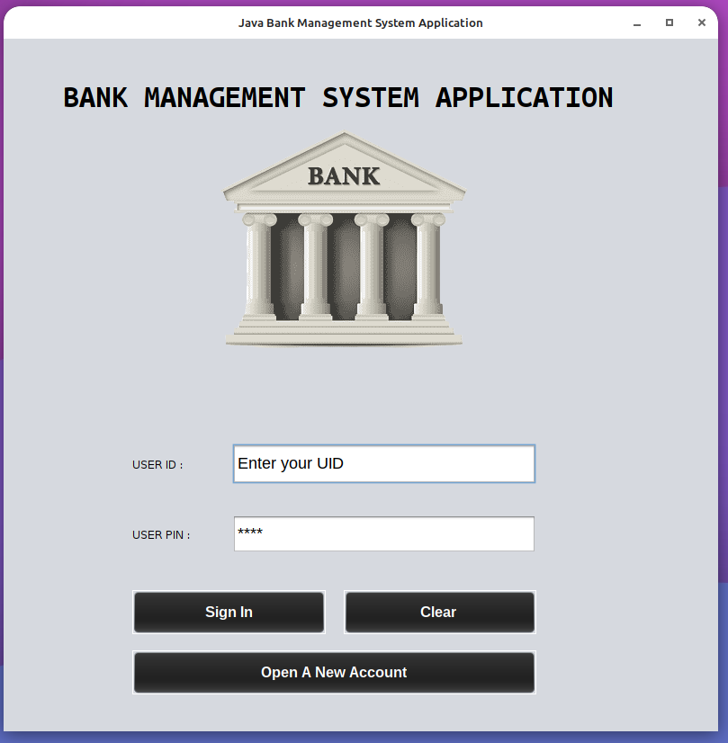
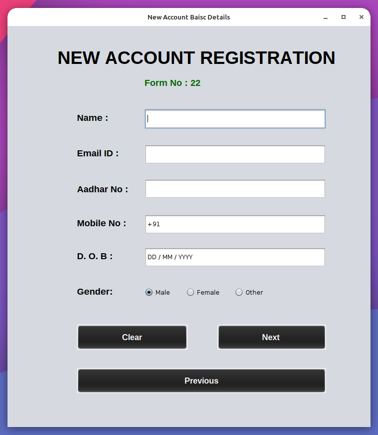
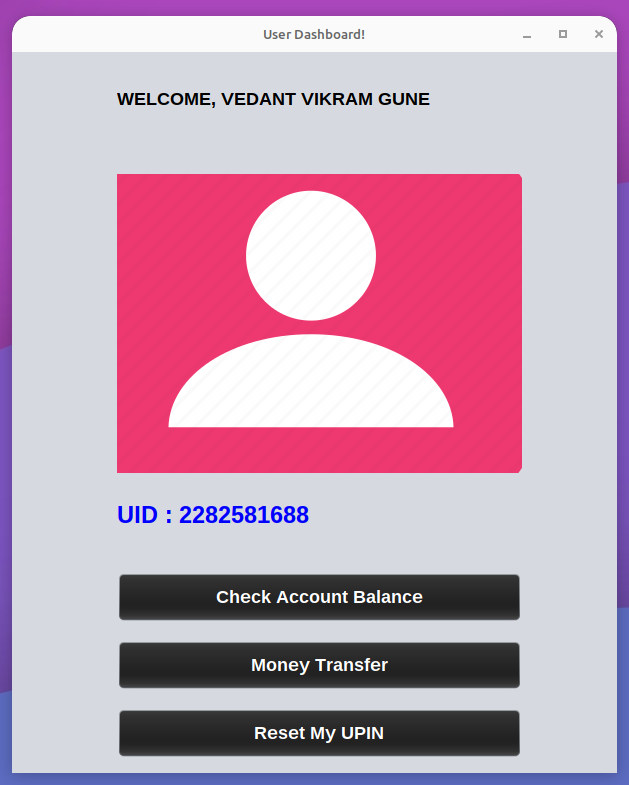
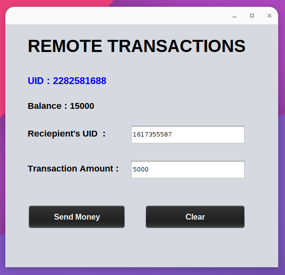
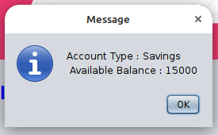

# Java Bank Management System Application

## Overview

The Java Bank Management System Application is a desktop application developed using Java Swing for the user interface, MySQL for database management, and JDBC for database connectivity. It allows users to create a bank account by providing basic details such as Aadhar card number, PAN card number, phone number, name, email, and initial deposit amount. Each user is assigned a unique 10-digit UID (User ID) and can set a 4 to 6-digit UPIN (User Personal Identification Number) during the account creation process. The user data is stored in the `ACCOUNTS` table within the `BankDB` database in MySQL.

## Features

1. **Account Creation:**
   - Users can create a new bank account by providing their Aadhar card number, PAN card number, phone number, name, email, and initial deposit amount.
   - Upon successful account creation, users receive a unique 10-digit UID and can set a UPIN.

2. **Account Login:**
   - Existing users can log in to their accounts using their UID and UPIN.

3. **Money Transfer:**
   - Users can transfer money to another account by providing the recipient's UID and the transfer amount.

4. **Account Balance Inquiry:**
   - Users can check their account balance to view the current available balance.

5. **UPIN Reset:**
   - Users can reset their UPIN if forgotten, providing necessary security information for verification.

## Prerequisites

- Java Development Kit (JDK)
- NetBeans IDE
- MySQL Database Server
- MySQL Connector/J (JDBC driver for MySQL)

## Database Configuration

1. Create a database named `BankDB` in MySQL.
2. Execute the SQL script provided in the `database.sql` file to create the necessary `ACCOUNTS` table.

## How to Run the Application

1. Open the project in NetBeans IDE.
2. Configure the MySQL database connection in the `DatabaseConnector.java` file.
3. Build and run the project from the IDE.

## Screenshots

## Feedback

We welcome your feedback! If you encounter any issues or have suggestions for improvement, please feel free to create an issue or reach out to the project maintainers.

Happy banking!
